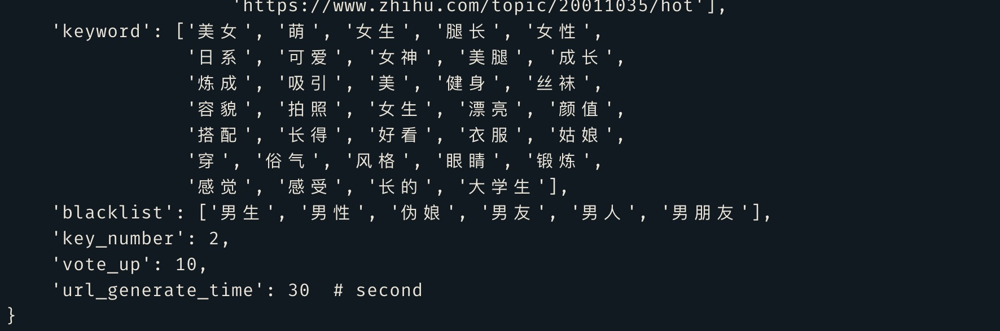
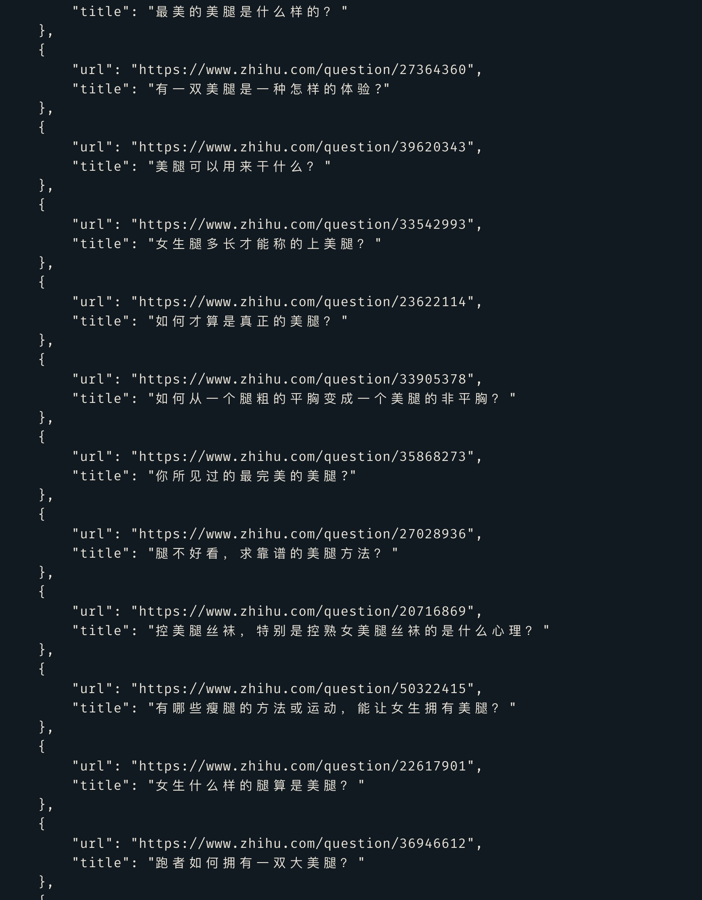
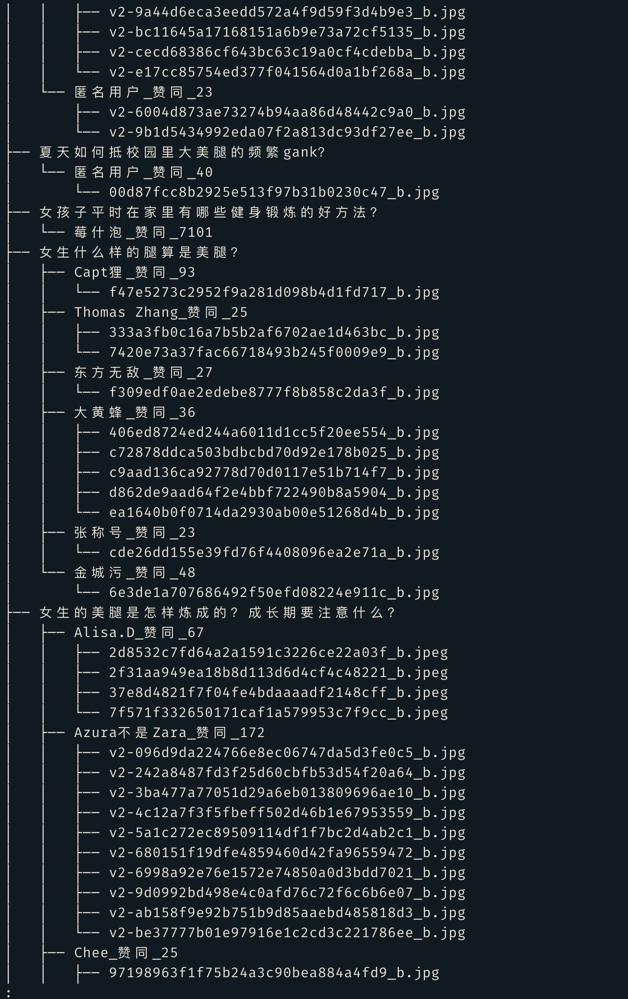
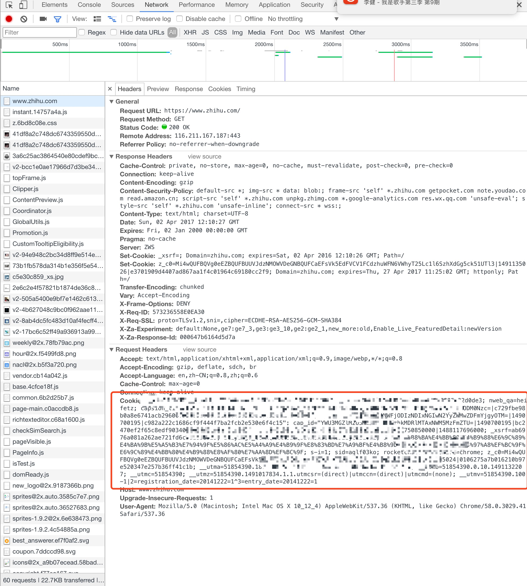

# zhihu_fun

> 基于 Selenium 的知乎关键词爬虫，仅支持 Python 3

## Demo








## 安装配置

### 安装 phantomjs
`zhihu_fun` 依赖 `phantomjs`, 且版本必须大于 2.1

```shell
$ wget https://bitbucket.org/ariya/phantomjs/downloads/phantomjs-2.1.1-linux-x86_64.tar.bz2

$ tar xf phantomjs-2.1.1-linux-x86_64.tar.bz2 -C /opt/

$ ln -sv /opt/phantomjs-2.1.1-linux-x86_64/bin/phantomjs /usr/bin/ # 确保 phantomjs 在 system PATH 路径下
```

### 配置 Nginx

为什么要使用 `Nginx`, 其实也可以不用，原因请看这个 `issue`

[readme 对小白如我不太友好 #5](https://github.com/AnyISalIn/zhihu_fun/issues/5)

```shell
# 确保 autoindex 和 charset 被正确配置
server {
        listen 80 default_server;
        listen [::]:80 default_server ipv6only=on;

        root /usr/share/nginx/html/zhihu_fun;
        autoindex on;
        index index.html index.htm;
        charset UTF-8;
        # Make site accessible from http://localhost/
        server_name localhost;

        location / {
                # First attempt to serve request as file, then
                # as directory, then fall back to displaying a 404.
                try_files $uri $uri/ =404;
                # Uncomment to enable naxsi on this location
                # include /etc/nginx/naxsi.rules
        }
    }
```

### 获取 Cookie

正常登陆 zhihu, 通过浏览器开发者工具中的 `network` 选项，获取 `Cookie`


### 配置运行 zhihu_fun

```shell
$ python
Python 3.5.3 # 仅支持 Python

$ git clone https://github.com/anyisalin/zhihu_fun.git /usr/share/nginx/html/zhihu_fun

$ cd /usr/share/nginx/html/zhihu_fun

$ vim go.html # 修改 <base href="http://localhost:8000"> 的地址为你当前的地址

$ pip install -r requirements.txt # 安装依赖

$ vim zhihu_fun/config.py # 修改 Cookie 为你的 Cookie, 或者修改其他配置

$ python run.py # 运行爬虫
```

## 配置选项

配置文件为 `zhihu_fun/config.py`

```python
config = {
    'start_url': 'https://www.zhihu.com/search?type=content&q=%E7%BE%8E%E8%85%BF',  # 爬虫的起始路径，如果没有设置，则为 zhihu 主页
    # 'start_url': '',
    'cookie': 'You Cookie', # 登录知乎，复制浏览器的 Cookie
    'root_url': 'https://www.zhihu.com',
    'log_level': 'info',  # support debug, info, warn
    'custom_urls': ['https://www.zhihu.com/search?type=content&q=%E7%BE%8E+%E7%BE%8E%E5%A5%B3', # 支持提供自定义的 URL
                    'https://www.zhihu.com/topic/19552207/hot',
                    'https://www.zhihu.com/question/51603251',
                    'https://www.zhihu.com/question/51644416',
                    'https://www.zhihu.com/topic/20011035/hot'],
    'keyword': ['美女', '萌', '女生', '腿长', '女性',    # 根据问题标题匹配，再根据 key_number 的值，来判定匹配多少个关键词加入待爬队列
                '日系', '可爱', '女神', '美腿', '成长',
                '炼成', '吸引', '美', '健身', '丝袜',
                '容貌', '拍照', '女生', '漂亮', '颜值',
                '搭配', '长得', '好看', '衣服', '姑娘',
                '穿', '俗气', '风格', '眼睛', '锻炼',
                '感觉', '感受', '长的', '大学生'],
    'blacklist': ['男生', '男性', '伪娘', '男友', '男人', '男朋友'], # 黑名单，如果问题标题匹配到黑名单中的词，则直接不匹配
    'key_number': 2,
    'vote_up': 10,  # 根据答案的赞同数来判定是否爬取图片
    'url_generate_time': 30  # 设置 url generate 运行的时间, 设置为 None 代表一直跑下去, 不能为 '', ""
```
